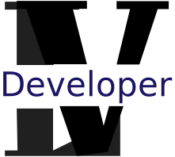

<a name="readme-top"></a>

<div align="center" >
<div style="background-color: #ffffff30;">
   
</div>
  <br/>

# Larry Villegas Portfolio
</div>


# 📗 Table of Contents 

- [📖 About the Project](#about-project)
  - [🛠 Built With](#built-with)
    - [Tech Stack](#tech-stack)
    - [Key Features](#key-features)
    - [Walkthrough to the Portfolio Project](#key-features)
  - [🚀 Live Demo](#live-demo)
- [💻 Getting Started](#getting-started)
  - [Setup](#setup)
  - [Prerequisites](#prerequisites)
  - [Install](#install)
  - [Usage](#usage)
  - [Run tests](#run-tests)
  - [Deployment](#triangular_flag_on_post-deployment)
- [👥 Authors](#authors)
- [🔭 Future Features](#future-features)
- [🤝 Contributing](#contributing)
- [⭐️ Show your support](#support)
- [🙏 Acknowledgements](#acknowledgements)
- [📝 License](#license)


# 📖 [Larry Villegas Portfolio] <a name="about-project"></a>

**[Larry Villegas Portfolio]** is a portfolio with a works as a developer

## 🛠 Built With <a name="built-with"></a>

### Tech Stack <a name="tech-stack"></a>

<details>
  <summary>Client</summary>
  <ul>
    <li><a href="https://developer.mozilla.org/es/docs/Web/HTML">HTML</a></li>
    <li><a href="https://developer.mozilla.org/en-US/docs/Web/CSS">CSS</a></li>
    <li><a href="https://developer.mozilla.org/en-US/docs/Web/JavaScript">JavaScript</a></li>
    <li><a href="https://astro.build/">Astro</a></li>
  </ul>
</details>
  
### Key Features <a name="key-features"></a>

**Enlist skill sets and tech stack**
- **Responsive design**
- **Mobile First methodology**
- **Walkthrough to the [Portfolio Project](https://www.loom.com/share/f2fdbd7445c8471990b5c3deda36544e)**

<p align="right">(<a href="#readme-top">back to top</a>)</p>

## 🚀 Live Demo <a name="live-demo"></a>

Click <a href="https://portfolio-larry.netlify.app/">here</a> to live versión.

<p align="right">(<a href="#readme-top">back to top</a>)</p>

## 💻 Getting Started <a name="getting-started"></a>

To get a local copy up and running follow these simple example.

### Prerequisites

In order to run this project you need:

  * Visual Studio Code
  * Browser [Chrome]
  * Linters

### Setup

Clone this repository to your desired folder:

Example commands:

```sh
  git clone git@github.com:LarryIVC/new-portfolio.git
  cd my-folder
```
### Install

Install this project with:

Example command:

```sh
  npm install
```
### Usage

To run the project, execute the following command:

Example command:

```sh
  npm run dev
```

<p align="right">(<a href="#readme-top">back to top</a>)</p>

<!-- AUTHORS -->

## 👥 Authors <a name="authors"></a>

👤 ** Larry Villegas **

- GitHub: [LarryIVC](https://github.com/LarryIVC)
- Twitter: [LarryVillegas](https://twitter.com/LarryVillegas)
- LinkedIn: [LinkedIn](https://linkedin.com/in/larryvillegascostas)

<p align="right">(<a href="#readme-top">back to top</a>)</p>

<!-- CONTRIBUTING -->

## 🤝 Contributing <a name="contributing"></a>

Contributions, issues, and feature requests are welcome!

Feel free to check the [issues page](https://github.com/LarryIVC/portfolio/issues).

<p align="right">(<a href="#readme-top">back to top</a>)</p>

<!-- SUPPORT -->

## ⭐️ Show your support <a name="support"></a>

Help me with your criticisms and your suggestions, you will be blessed for such a noble gesture and give me a ⭐️ if you like this project.

<p align="right">(<a href="#readme-top">back to top</a>)</p>

<!-- ACKNOWLEDGEMENTS -->

## 🙏 Acknowledgments <a name="acknowledgements"></a>

- I would like to thank [Microverse](https://www.microverse.org/?grsf=l49pe7) for this template that I based it on.
- I would like thank to [Bartoz Jarocki](https://github.com/BartoszJarocki/cv)
- I would like thank to [@Midudev](https://midu.dev/) for the tutorial [resume](https://www.youtube.com/watch?v=Zwh92LTB-Bk&t=3207s&ab_channel=midulive), and all other tutorials, he is like my master.
- I would like thank to [JSON Resume](https://jsonresume.org/)

<p align="right">(<a href="#readme-top">back to top</a>)</p>

<!-- LICENSE -->

## 📝 License <a name="license"></a>

This project is [MIT](./LICENSE) licensed.

<p align="right">(<a href="#readme-top">back to top</a>)</p>
